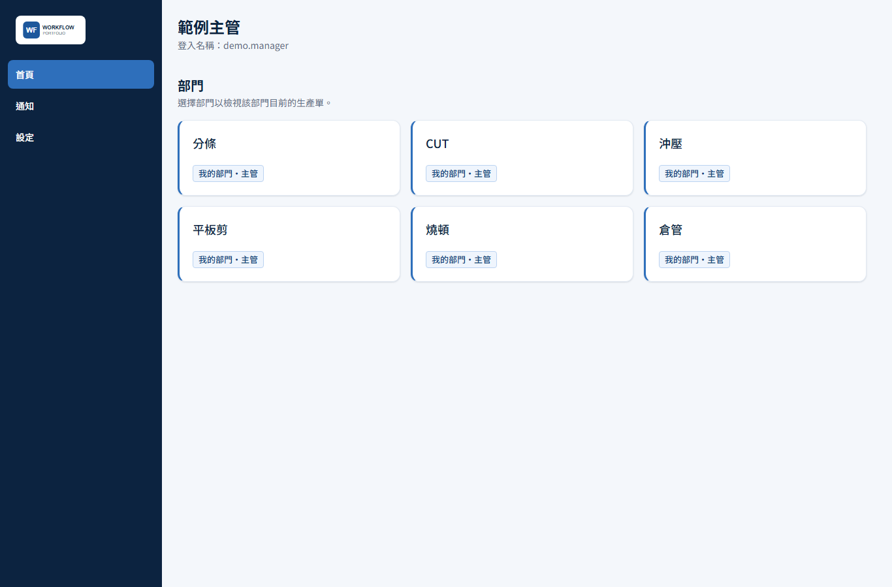
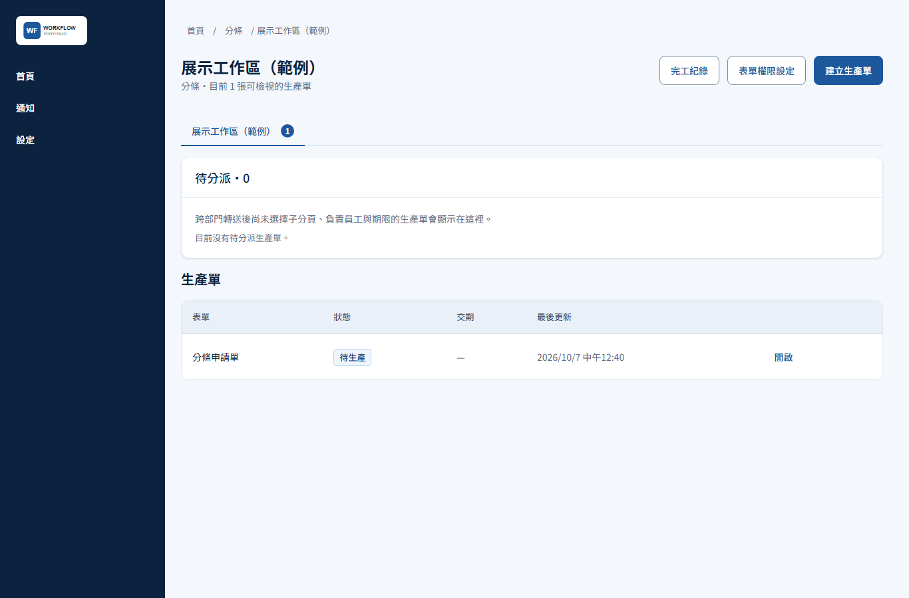
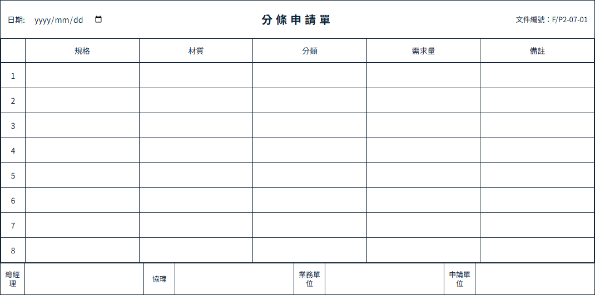
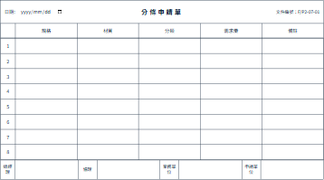
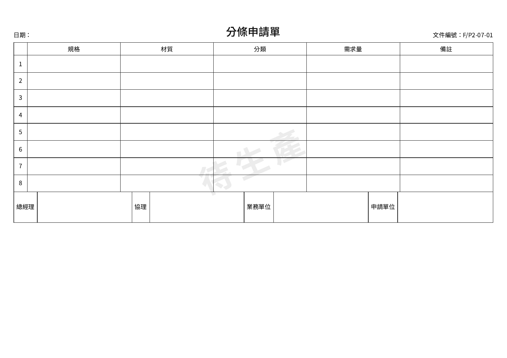

# Production Workflow Portfolio

[](https://github.com/ThomasChien0413/production-workflow-portfolio/actions/workflows/ci.yml)

A responsive Traditional Chinese manufacturing workflow application, shared with the owner's permission as an interview portfolio. This is an independent, sanitized snapshot—not the company's operational repository or production service.



## What it demonstrates

- Six departments: 分條, CUT, 沖壓, 平板剪, 燒頓, 倉管, with configurable subpages, template selections and additive department identities.
- API-enforced 查看、建立、修改、送審 grants, account administration and ordered 業務 → 協理 → 總經理 review where a template requires it.
- Version-pinned, source-backed forms; optimistic concurrency, live presence, immutable workflow/audit history, routing and destination-subpage placement.
- Authenticated print-faithful PDF export and separate private PDF attachments with streaming, idempotency and durable deletion.
- Completion-history search, durable in-app notifications and optional browser push.
- Blue-and-white desktop/mobile UI, semantic status labels, accessibility checks and visual regression coverage.

All 27 authorized form templates and letterheads are retained. Real saved orders, employees, uploads, credentials, infrastructure identifiers, operational documents and original Git history are excluded. Example accounts and test values are synthetic.

## Screenshots and sample PDF

These captures use only the labelled `demo.manager` account and a blank, unsubmitted sheet in an isolated local database. They are not company operational screenshots. The initializer itself creates no sheets; the capture walkthrough creates one through the normal authenticated workflow. Pending signatures remain blank, and the PDF keeps its visible state watermark.

<details>
<summary>Department subpage and desktop paper form</summary>





</details>

<details>
<summary>Mobile paper-form view and exported PDF</summary>





[Download the blank demonstration PDF](docs/examples/blank-demo-sheet.pdf). This is a one-page A4 landscape export of saved blank values, not an approved order.

</details>

## Architecture

| Area | Implementation |
| --- | --- |
| Web | Next.js / React, responsive server-rendered pages |
| API | Fastify REST + authorized WebSocket rooms |
| Worker | PostgreSQL-backed durable jobs and notification/deletion retries |
| Database | PostgreSQL 17, Drizzle schema and additive SQL migrations |
| Shared packages | Runtime contracts, domain policies, UI, sheet rendering and attachment storage |
| PDF | Playwright Chromium with local CJK fonts, no external rendering requests |

See [architecture and interview notes](docs/ARCHITECTURE.md) and the [demo walkthrough](docs/DEMO.md).

## Run locally

Requires Node.js 24+, pnpm 11.16.0 and Docker with Compose. Do not connect this copy to a company database. The migration/seed scripts refuse production mode, remote hosts and unrelated database names.

```sh
pnpm install --frozen-lockfile
# Copy .env.example to .env using your editor/file manager.
docker compose up -d postgres
pnpm build
pnpm db:migrate
pnpm db:seed
pnpm db:verify
pnpm db:verify-runtime
# Optional: five synthetic accounts and six configured demo subpages.
pnpm db:demo
pnpm --filter @workflow/api exec playwright install chromium
```

Start these in separate terminals:

```sh
pnpm dev:api
pnpm dev:web
pnpm dev:worker
```

Open **http://localhost:3000**. Bootstrap login: **admin / DemoOnly2026!**. Optional demo logins: `demo.manager`, `demo.staff`, `demo.sales`, `demo.associate`, `demo.gm`, all using that same deliberately public password. Never expose this seeded instance to the Internet. The password warning remains until changed. See the [walkthrough](docs/DEMO.md) for each identity and how to demonstrate permissions.

`db:demo` is optional and runs separately from the base seed. On first initialization it requires only the active bootstrap admin and no existing sheets/subpages. It creates no saved orders, fake signatures, completed sheets or push subscriptions. Repeating it does not reset passwords, reactivate users or overwrite permissions. Existing manual work causes a refusal, not a reset.

## Engineering decisions worth exploring

Immutable template versions protect historical forms; explicit identity grants prevent creator/assignee exceptions from leaking records; optimistic concurrency rejects stale writes; transactions and durable jobs keep external failures separate from saved workflow state. PDF exports capture canonical saved data, while attachment binaries remain independently authorized. See [the trade-offs and code entry points](docs/ARCHITECTURE.md).

Local database defaults are `workflow_demo`, user `workflow`, password `workflow_local`. Compose binds ports to loopback. Attachments go to ignored `.local/` storage; PDFs are generated on demand. Push is optional—leave demo VAPID keys blank unless generating a new pair with `pnpm push:vapid-keys`.

Alternatively, after migrating/seeding the local database, `docker compose up --build` runs all four containers. Container builds may be slow because the API image installs Chromium and CJK fonts. Do not run `docker compose down -v` unless deliberately deleting your own demo data.

## Verification

```sh
pnpm publication:audit
pnpm ops:test
pnpm ops:validate-example
pnpm typecheck
pnpm lint
pnpm test
pnpm build:web
pnpm test:e2e
pnpm test:branding
```

Database integration tests require **TEST_DATABASE_URL** pointing to a separate local `workflow_demo_test` database. Without it they are reported as skipped, not verified. Migrate/seed that test target using DATABASE_URL before E2E. Never point tests at an instance holding useful data.

The optional fixture integration test uses a second, dedicated `workflow_demo_fixture_test` database via **DEMO_TEST_DATABASE_URL**. It checks concurrent initialization, repeated runs, preserved password/grant changes and refusal of manually configured workspaces. CI prepares this target separately so fixture reviewers cannot conflict with the workflow suite.

Form pixel baselines run on Linux; neutral login-branding baselines run on Windows. See [browser testing](apps/web/e2e/README.md). Standard GitHub-hosted CI is read-only and runs only after this repository is public; it intentionally skips private runs to avoid consuming private-repository Actions quota. It has no production deployment or company-runner connection.

## Scope, provenance and rights

This project was developed collaboratively with human direction and AI-assisted engineering/design. It demonstrates system architecture and implementation decisions; it does not claim sole authorship or independent creation of company forms. Authorized letterheads remain their owner's property and do not imply endorsement.

The code is shared for portfolio review. **No general open-source redistribution license has been selected.** Public visibility alone is not an MIT/Apache license grant. Third-party dependencies and the vendored Noto Sans TC font retain their respective licenses; see [notices](THIRD_PARTY_NOTICES.md).

No public hosted demo, paid resources or production deployment is included. Generic deployment examples describe architecture only and are not ready-to-run credentials or a company deployment recipe. See [security and publication boundaries](SECURITY.md) and [verification status](PLAN.md).
